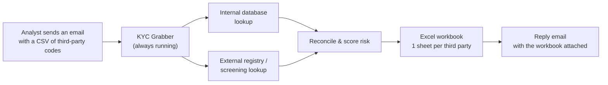
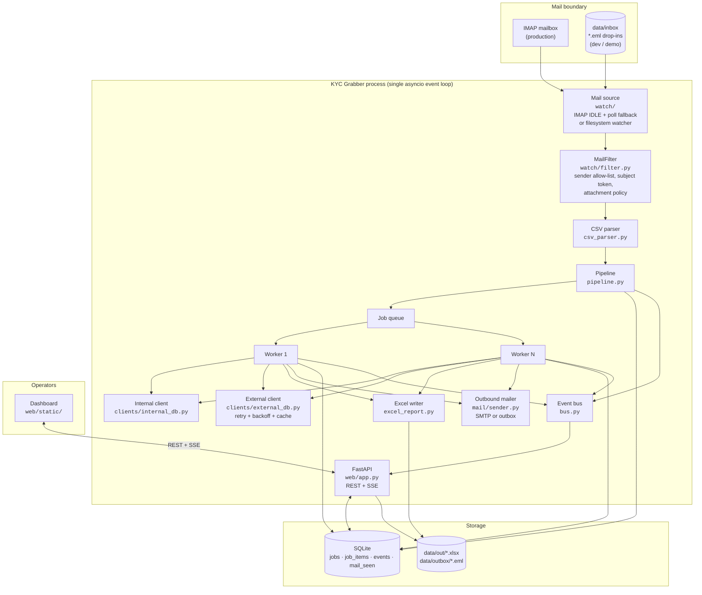
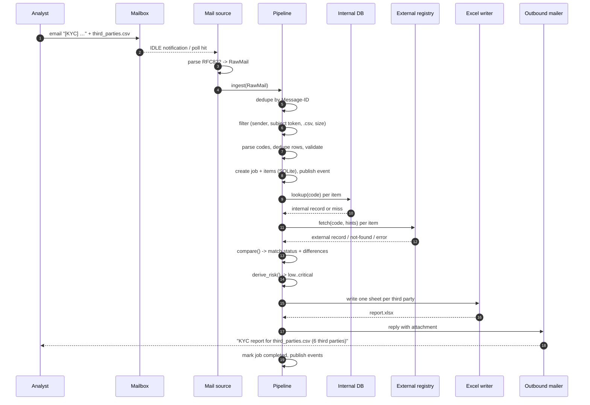
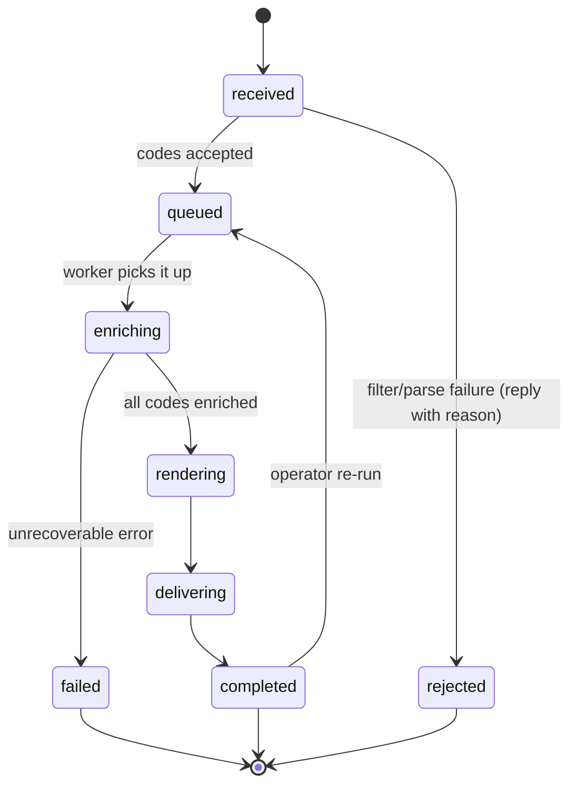
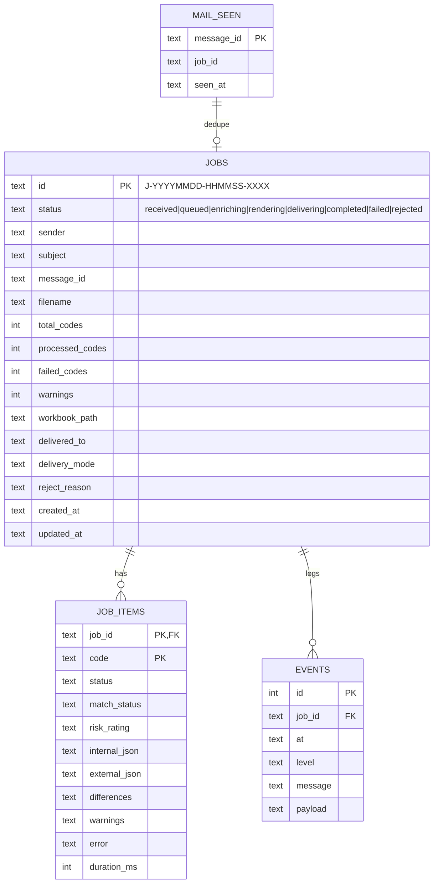
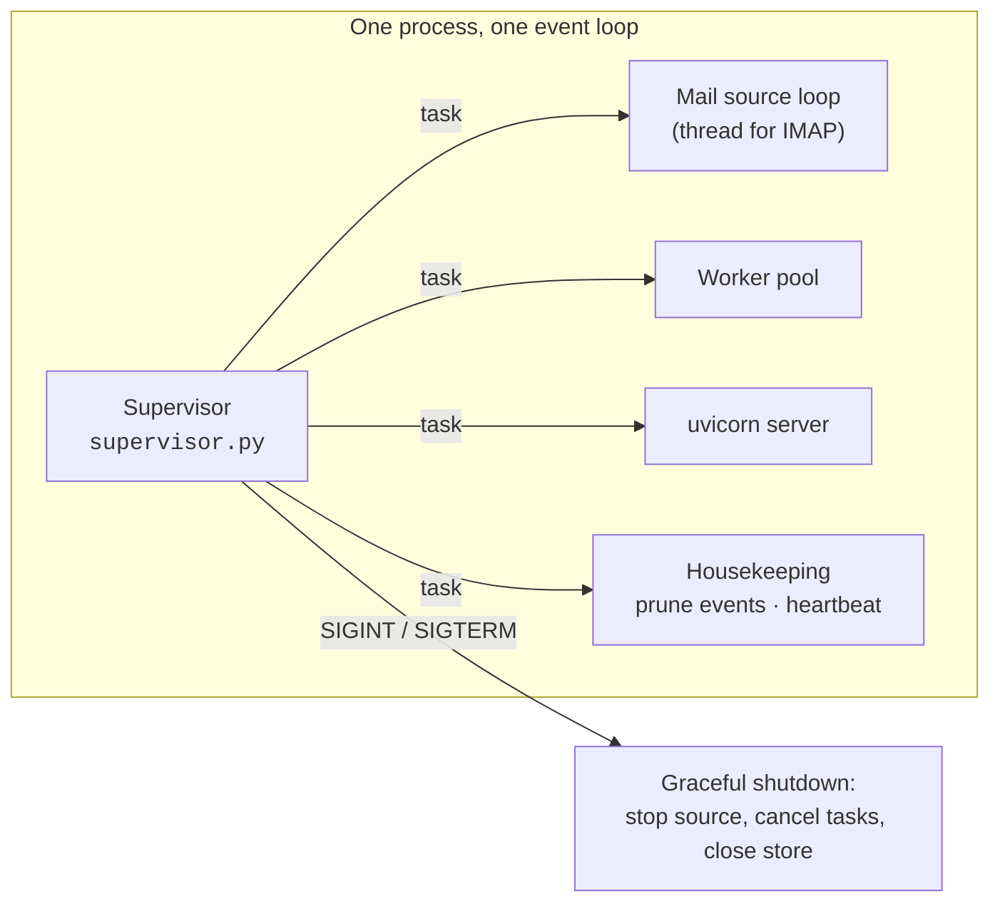

# KYC Grabber — architecture

> Status: framework/stub. The internal database and the external registry are **simulated**;
> every payload they return is marked as synthetic demo data.

## 1. What the service does

## 2. Container view

## 3. Happy path (sequence)

## 4. Job state machine

Per third-party outcome (`job_items.match_status`):

| Value | Meaning |
| --- | --- |
| `match` | Internal and external records agree on name, country and entity type |
| `mismatch` | Records exist but differ — differences are listed in the sheet |
| `internal_only` | Known internally, no external registry record |
| `external_only` | Found externally but missing from the internal master data |
| `not_found` | Present in neither source |
| `error` | A source lookup failed (timeout, provider outage) |

## 5. Data model

## 6. Always-on operation

Resilience rules baked into the framework:

* the mail source reconnects with exponential backoff on any IMAP/network error;
* a corrupt or unparseable email is archived and skipped, never crashing the watcher;
* per-code lookups are isolated — a failing code produces an `error` row, the job still completes;
* the external client retries transient failures with backoff and caches results;
* the worker pool never dies because of a single bad job;
* re-delivered emails are ignored via the `mail_seen` dedupe table (Message-ID).

## 7. Where real integrations plug in

| Component | File | Replace with |
| --- | --- | --- |
| Internal database | `kyc_grabber/clients/internal_db.py` | SQLAlchemy/pyodbc/HTTP client against the real master data. Drop the latency simulation. |
| External registry | `kyc_grabber/clients/external_db.py` | Real provider call (KYC/registry API, Dow Jones, Refinitiv…). Keep retry/backoff/cache/concurrency; map the payload to `ExternalRecord`. |
| Mail intake | `kyc_grabber/watch/imap_source.py` | Point `KYC_MAIL__IMAP__*` at the real mailbox; swap the password for OAuth2 (XOAUTH2) if required. |
| Delivery | `kyc_grabber/mail/sender.py` | Set `KYC_OUTBOUND__MODE=smtp` and the relay settings. |
| Reconciliation rules | `kyc_grabber/analysis.py` | Tighten name matching, add field-level rules, wire a risk engine. |
| Report layout | `kyc_grabber/excel_report.py` | Adjust sections/columns; keep the one-sheet-per-third-party contract. |

## 8. Threat-model notes (for the production build)

* Credentials must live in `.env`/a secret store, never in Git (`.env` is git-ignored; only `.env.example` is committed).
* Inbound mail is untrusted input: the filter restricts senders, the CSV parser validates codes and caps size/count.
* The dashboard is bound to localhost by default; put it behind SSO/reverse proxy before exposing it.
* The workbook may contain personal data (directors, PEP flags) — outbound email should be encrypted (S/MIME or a secure link) once real data is used.
