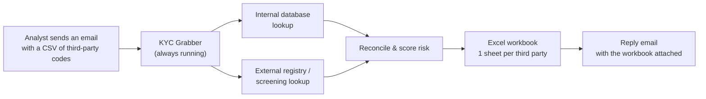
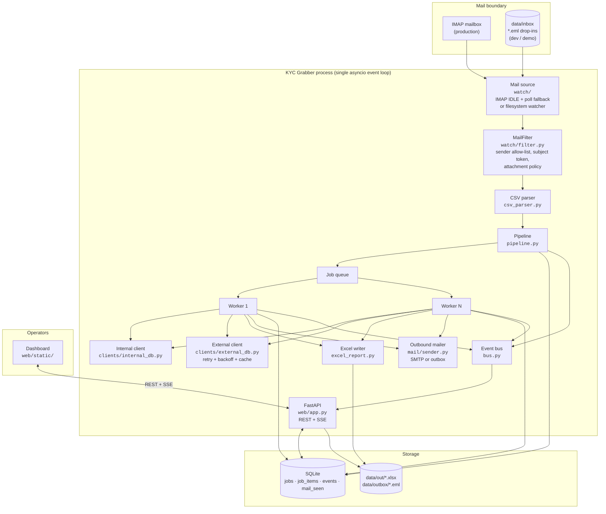
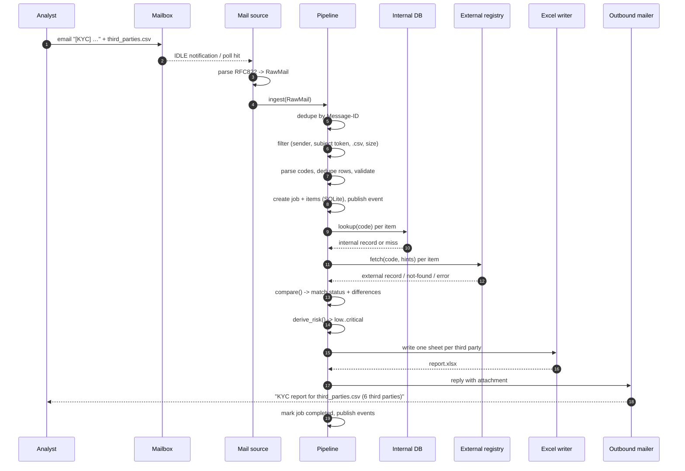
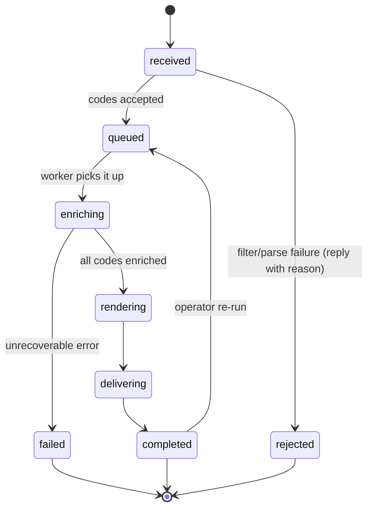
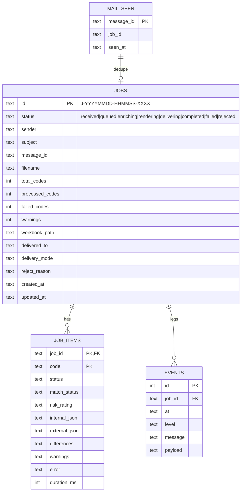
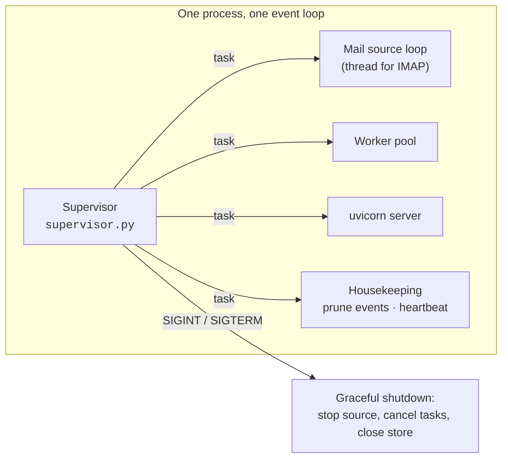

# Diagrams

Standalone copies of the mermaid diagrams in [`../architecture.md`](../architecture.md).

**Generated file — do not edit by hand.** Change the markdown, then regenerate:

```powershell
python scripts/export_diagrams.py            # refresh the .mmd files and this page
python scripts/export_diagrams.py --render   # also produce SVG + PNG in rendered/
```

## How to view them

* **Right here** — press <kbd>Ctrl</kbd>+<kbd>Shift</kbd>+<kbd>V</kbd> in VS Code (or
  <kbd>Ctrl</kbd>+<kbd>K</kbd> <kbd>V</kbd> for a side-by-side preview): every diagram below
  renders live, no extension required. GitHub renders this page the same way.
* **As images** — `python scripts/export_diagrams.py --render` writes SVG and PNG copies to
  `rendered/` (git-ignored); open those in any image viewer.
* **Editing** — paste any `.mmd` file into [mermaid.live](https://mermaid.live) for a live
  editor with export options.

## Index

| File | Section in architecture.md | Type |
| --- | --- | --- |
| [`what-the-service-does.mmd`](what-the-service-does.mmd) | What the service does | flowchart |
| [`container-view.mmd`](container-view.mmd) | Container view | flowchart |
| [`happy-path-sequence.mmd`](happy-path-sequence.mmd) | Happy path (sequence) | sequence |
| [`job-state-machine.mmd`](job-state-machine.mmd) | Job state machine | state machine |
| [`data-model.mmd`](data-model.mmd) | Data model | entity relationship |
| [`always-on-operation.mmd`](always-on-operation.mmd) | Always-on operation | flowchart |

## Rendered diagrams

### What the service does

<sub>`what-the-service-does.mmd` · flowchart</sub>



### Container view

<sub>`container-view.mmd` · flowchart</sub>



### Happy path (sequence)

<sub>`happy-path-sequence.mmd` · sequence</sub>



### Job state machine

<sub>`job-state-machine.mmd` · state machine</sub>



### Data model

<sub>`data-model.mmd` · entity relationship</sub>



### Always-on operation

<sub>`always-on-operation.mmd` · flowchart</sub>


